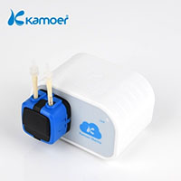
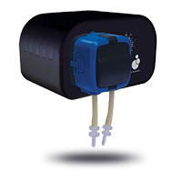

X1/P1 dosing pump control script
--------------------------------




This **nodejs** scripts allows you to control your Bluetooth dosing pump
[Kamoer X1][1] or [D-D P1][2] without using the official [Android][3] or
[iOS][4] applications.
Indeed The **Android** application have a very poor compatibility of devices
and API version, making it unusable, for example in recent mobile phones with
**LineageOS**.

Also there are a lot of users complains that the automatic planned dosing does
not work very well and the pumps loses settings if the application is not opened
regularly or on power outage. With this script on the contrary you can create
what ever plan you want by simply use [cron][5] utility, which is more reliable.

This was achieved by **reverse engineering**, thanks on [post and videos][6] of
the hacker [Mike Ryan][7].
For now only the manual dosing is supported (in complement with cron). Feel free
to do a merge request if you want more functionalities of the official application.

Requirements:
-------------

- Bluetooth configured and working on your system.
- [gatttol][8] command.
- NodeJs

```js
const pump = require('./pump')

const dosing = async () => {
  await pump.start(10) // Liquid volume in ml.
  await pump.sleep() // Optional
  await pump.stop() // Optional
}

dosing()
```

The **sleep** and **stop** methods are optional. They are not required because
the pump stop by itself. But there are user (of the official application) that
complains that sometimes the manual dosing is not well stop.

You can pass to **start** method the volume in **ml** and also the calibration,
or you can set them on the **config.js** file.

You have to set the **MAC** address of your pump on the **config.js** file, run
the following command to found your **MAC** address:

```sh
sudo hcitool lescan
```

Using cron
----------

To schedule a dosing, you can use regular **crontab** command, **node-cron** or
even **PM2**.
In My case I opt for [PM2][9] with the **--cron** flag:

```sh
$ pm2 start index.js --cron "0 5 */10 * *"
$ pm2 save
```

TODO
----

- There is no a retry system in case of failure. In my case this is no yet needed
because I use a [Raspberry PI Zero W][10] which is very close to the pump.
- There is no yet multiple simultaneous pump support.

[1]: http://www.kamoer.com/Products/showproduct.php?id=575&lang=en
[2]: https://www.theaquariumsolution.com/product/8194/319
[3]: https://play.google.com/store/apps/details?id=com.kamoer.x1dosingpump&hl=en_US&gl=US
[4]: https://apps.apple.com/us/app/x1-pump/id1400671862
[5]: https://en.wikipedia.org/wiki/Cron
[6]: https://www.youtube.com/watch?v=gCQ3iSy6R-U
[7]: https://lacklustre.net/
[8]: http://manpages.ubuntu.com/manpages/hirsute/man1/gatttool.1.html
[9]: https://pm2.keymetrics.io/
[10]: https://www.raspberrypi.org/products/raspberry-pi-zero-w/
